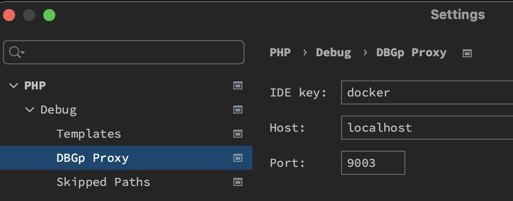
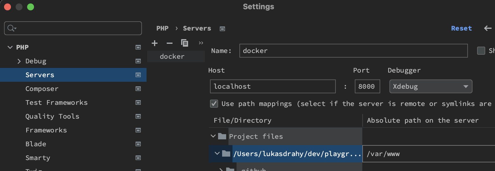

### Stack
 - Symfony LTS
 - VueJS 3.2
### Req
 - PHP 8.2
 - MySQL 8
 - Node v20.2.0
### Installation (dev)
 - You need Docker to be installed on your machine (https://docs.docker.com/get-docker/) 
```bash
cp .env.dist .env && cp .env.test.dist .env.test
./dcp build
./dcp db-build
```
 - Got o http://localhost:8000
### Testing
```bash
composer all #run all checks
composer fix #run CS Fixer
composer stan #run PHPStan
composer test #run unit & functional tests
composer unit #run unit tests
composer func #run functional tests
```

### XDebug in PHPStorm

 - Configure DBGP
    

 - Configure path mappings
   

Download [XDebug helper](https://chrome.google.com/webstore/detail/xdebug-helper/eadndfjplgieldjbigjakmdgkmoaaaoc) and set cookie value to `docker`.
Now you have have the possibility to debug requests from browser.
